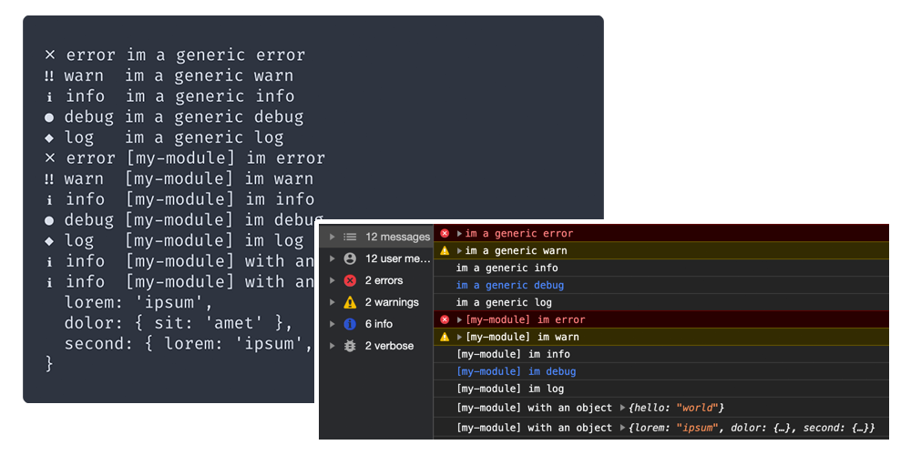

<div align="center">
	<h1 align="center">diary</h1>
	<p align="center"><code>yarn add diary</code> makes logging simple</p>
	<hr />
	<span>
		<a href="https://github.com/maraisr/diary/actions?query=workflow:CI+branch:main">
			
		</a>
		<a href="https://npm.im/diary">
			
		</a>
		<a href="https://bundlephobia.com/result?p=diary">
			
		</a>
	</span>
</div>



## ⚡ Features

- No [dependencies](https://npm.anvaka.com/#/view/2d/diary)
- Outstanding [performance](#-benchmark)
- Support for [`debug`'s filter](https://www.npmjs.com/package/debug#wildcards)
- Browser compatible through `localStorage`
- Middleware to pipe into Sentry or alike

## ⚙️ Install

```sh
yarn add diary
```

## 🚀 Usage

```ts
import { info, diary, middleware } from 'diary';

middleware((logEvent) => {
  if (logEvent.level === 'error') {
    Sentry.captureException(logEvent.extra[0]);
  }
});

info('this important thing happened');
// ~> ℹ info  this important thing happened

const scopedDiary = diary('my-module');
scopedDiary.info('this other important thing happened');
// ~> ℹ info  [my-module] this other important thing happened
```

Controlling runtime emission of logs:

### _browser_

```ts
import { diary } from 'diary';

localStorage.setItem('DEBUG', 'scopeA:two,scopeB:*');

const scopeA1 = diary('scopeA:one');
const scopeA2 = diary('scopeA:two');
const scopeB1 = diary('scopeB:one');
const scopeB2 = diary('scopeB:two');

scopeA1.info('message'); // won't log ✗
scopeA2.info('message'); // will log ✔
scopeB1.info('message'); // will log ✔
scopeB2.info('message'); // will log ✔
```

#### _node_

```ts
// example.js
import { diary } from 'diary';

const scopeA1 = diary('scopeA:one');
const scopeA2 = diary('scopeA:two');
const scopeB1 = diary('scopeB:one');
const scopeB2 = diary('scopeB:two');

scopeA1.info('message'); // won't log ✗
scopeA2.info('message'); // will log ✔
scopeB1.info('message'); // will log ✔
scopeB2.info('message'); // will log ✔
```

> `$ DEBUG=scopeA:two,scopeB:* node example.js`

## 🔎 API

### diary(name: string)

Returns: [log functions](#log-functions)

> A default diary is exported, accessible through simply importing any
> [log function](#log-functions).
>
> <details>
> <summary>Example of default diary</summary>
>
> ```ts
> import { info } from 'diary';
>
> info("i'll be logged under the default diary");
> ```
>
> </details>

#### name

Type: `string`

The name given to this _diary_, will appear in the middleware under the `name`
property as well as in console messages.

### _log functions_

A set of functions that map to `console.error`, `console.warn`, `console.debug`,
`console.info` and `console.info`. Aptly named;

- `fatal(message: string|Error, ...extra: any[])`
- `error(message: string|Error, ...extra: any[])`

  If an `Error` instance is sent, the error object will be accessible through
  the first item in the `extra`'s array in a middleware. This is for both
  `fatal` and `error`.

- `warn(message: string, ...extra: any[])`
- `debug(message: string, ...extra: any[])`
- `info(message: string, ...extra: any[])`
- `log(message: string, ...extra: any[])`

All `extra` parameters are simply spread onto the console function, so
node/browser's built-in formatters will format any objects etc.

## middleware(callback: function, diary?: Diary)

Returns: `void`

Middlewares are function handlers that run for every
[log function](#log-functions). They allow for modifying the log event object,
or simply returning `false` to bailout. Executing in a _forwards_ direction,
meaning middlewares will be run sequentially as they were defined.

#### handler

Type: `Function`

Which gets given a single argument of:

```ts
type LogEvent = {
  name: string;
  level: LogLevels;
  message: string | Error;
  extra: unknown[];
};
```

<details>
<summary>Example</summary>

```ts
import { middleware, info } from 'diary';

middleware((logEvent) => {
  if (logEvent.level === 'error') {
    fetch('/api/errors', {
      method: 'POST',
      body: JSON.stringify({ error: logEvent.extra[0] }),
    });
  }
});

info('something informative');
```

> This method isn't a Promise, so won't be awaited. It's a fire and forget kinda
> deal.

</details>

#### diary (optional)

Type: `Diary`

The result of a calling [diary](#diary-name-string);

A middleware without the optional second parameter, will run for all diaries.

### setLevel(level: LogLevel)

Returns: `void`

Sets the level form which log's will get output to the console.

#### level

Type: `string`

One of the [log functions](#log-functions)'s name.

<details>
<summary>Example</summary>

```ts
import { setLevel, info } from 'diary';
setLevel('error');

info('something informative');
```

</details>

> Note; this will also filter the events from all middlewares.

## 💨 Benchmark

```
Validation
✔ diary
✔ debug
✔ pino
✔ winston

Benchmark
  diary      x 570,331 ops/sec ±1.35% (85 runs sampled)
  debug      x 217,275 ops/sec ±0.88% (87 runs sampled)
  pino       x 49,985 ops/sec ±0.85% (91 runs sampled)
  winston    x 12,333 ops/sec ±6.44% (79 runs sampled)
```

> Ran with Node v15.5.0

# 🧑‍🍳 Recipes

<details>
<summary>Log uncaught exceptions</summary>

### _node_

```ts
import { error } from 'diary';

process.on('uncaughtException', (err) => {
  error(err);
});
```

### _browser_

```ts
import { error } from 'diary';

window.addEventListener('error', (err) => {
  error(err);
});
```

</details>

## License

MIT © [Marais Rossouw](https://marais.io)
