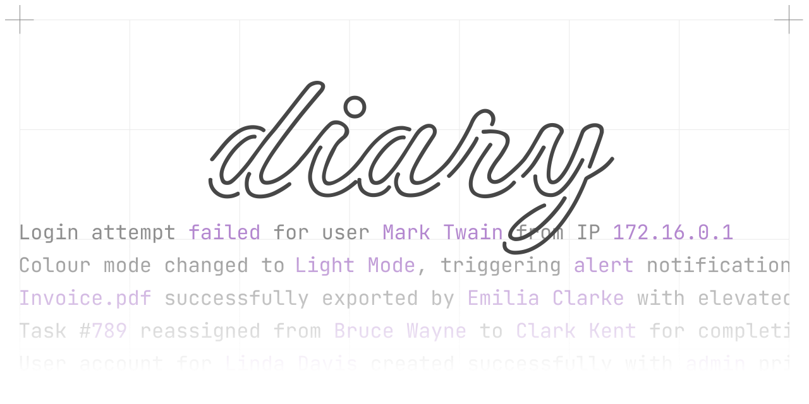

<br>

<div align="center">

<a href="https://git.new/log" aria-label="diary">
    <picture>
        <source media="(prefers-color-scheme: dark)" srcset=".github/logo_dark.svg">
        
    </picture>
</a>

[](https://npm-stat.com/charts.html?package=diary)
[](https://bundlephobia.com/package/diary)
[](https://licenses.dev/npm/diary)

<br>
<br>

<sup>

This is free to use software, but if you do like it, consisder supporting me ❤️

[](https://github.com/sponsors/maraisr)
[](https://www.buymeacoffee.com/marais)

</sup>

</div>

## ⚙️ Install

- **npm** — available as [`diary`](https://www.npmjs.com/package/diary)
- **JSR** — available as [`@mr/diary`](https://jsr.io/@mr/diary)

## 🚀 Usage

```ts
import { diary } from 'diary';
import { pretty } from 'diary/output.console';

let user = { name: 'marais', type: 'admin' };

// 1️⃣ create a diary
let log = diary(pretty);

// 2️⃣ log something
log('info', '{name} is now {type}', user);
// ~> ℹ info marais is now admin

// 💡 log message as completely typesafe
log('debug', '{name} was created {at}', user);
//                                ^? Error: 'at' is not defined
```

</details>

Diary is an expressive structured logging library.

:construction: Talk about structured logging

:construction: Talk about fragments vs sentences

:construction: Talk about onEmit

:construction: Show /using and /stream

:construction: Complete examples

:construction: What does production look like?

## 💨 Benchmark

TODO

## License

MIT © [Marais Rossouw](https://marais.io)
